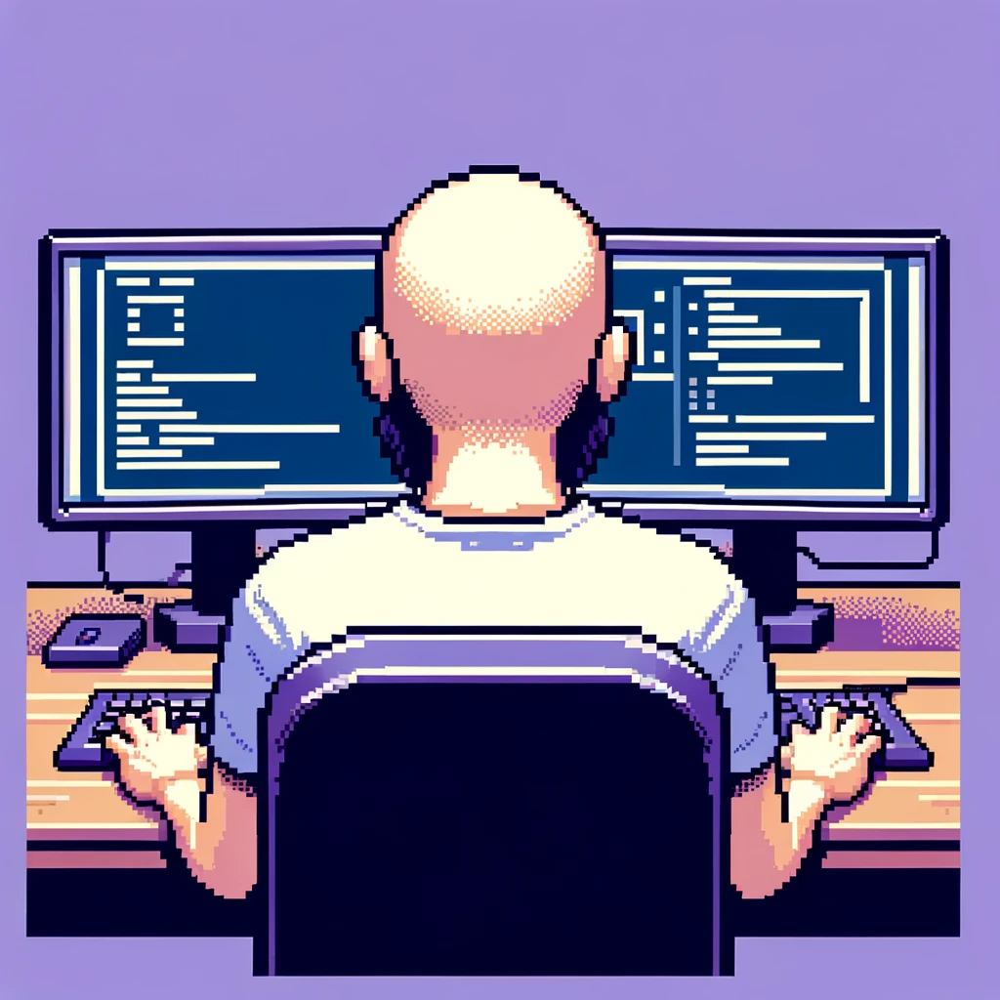

<!-- Heading -->
<h1 align="center"> ¡HOLA BIENVENIDO!, A MI REPOSITORIO DE ESTUDIO</h1>

<h2>Sobre mi:</h2>

### Me presento soy "**DevsDav**", un Ingeniero Electrónico que ha encontrado su pasión en programar, me encuentro aprendiendo sobre el mundo del desarrollo y quisiera compartir mi proyectos con ustedes, espero aportar para bien, un abrazo y espero te guste.

<h1 align="center">

</h1>

<h2>Tambien estoy en:</h2>

 
  &nbsp;&nbsp;&nbsp;&nbsp;
  <a href="https://www.instagram.com/devsdav?igsh=MWtvd3J3NDd5eThmMA==">&nbsp;&nbsp;&nbsp;&nbsp;  
  &nbsp;&nbsp;&nbsp;&nbsp;</a>
  &nbsp;&nbsp;&nbsp;&nbsp;

<!--
**DAVstudy/DAVstudy** is a ✨ _special_ ✨ repository because its `README.md` (this file) appears on your GitHub profile.

Here are some ideas to get you started:

- 🔭 I’m currently working on ...
- 🌱 I’m currently learning ...
- 👯 I’m looking to collaborate on ...
- 🤔 I’m looking for help with ...
- 💬 Ask me about ...
- 📫 How to reach me: ...
- 😄 Pronouns: ...
- ⚡ Fun fact: ...
-->
